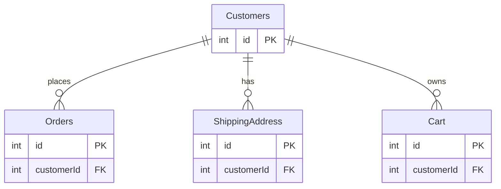
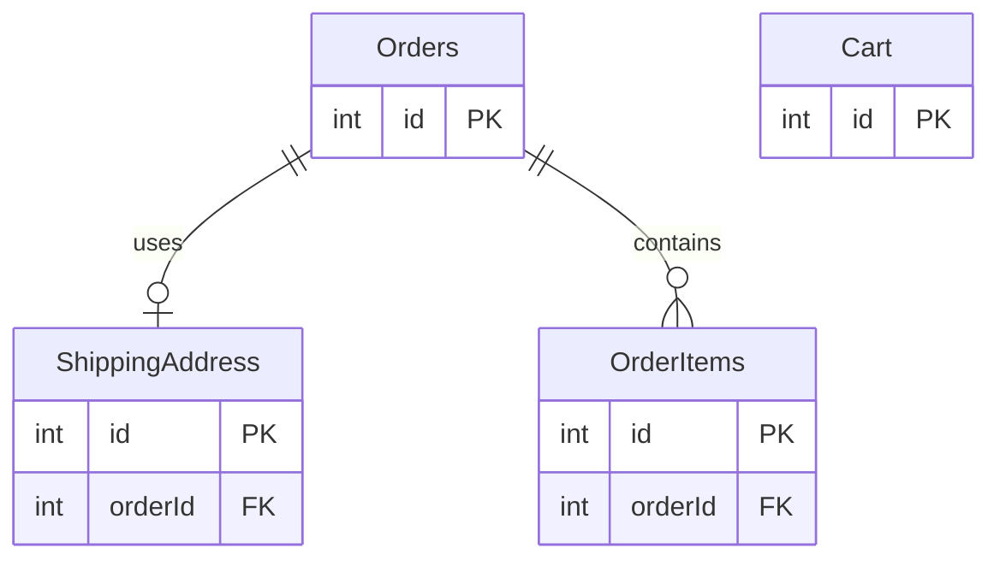
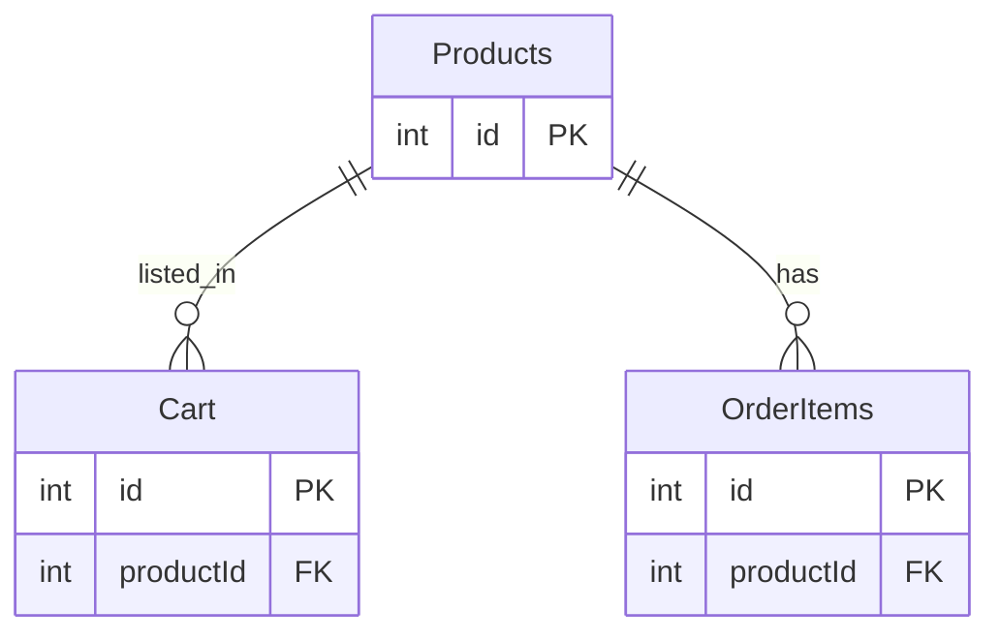
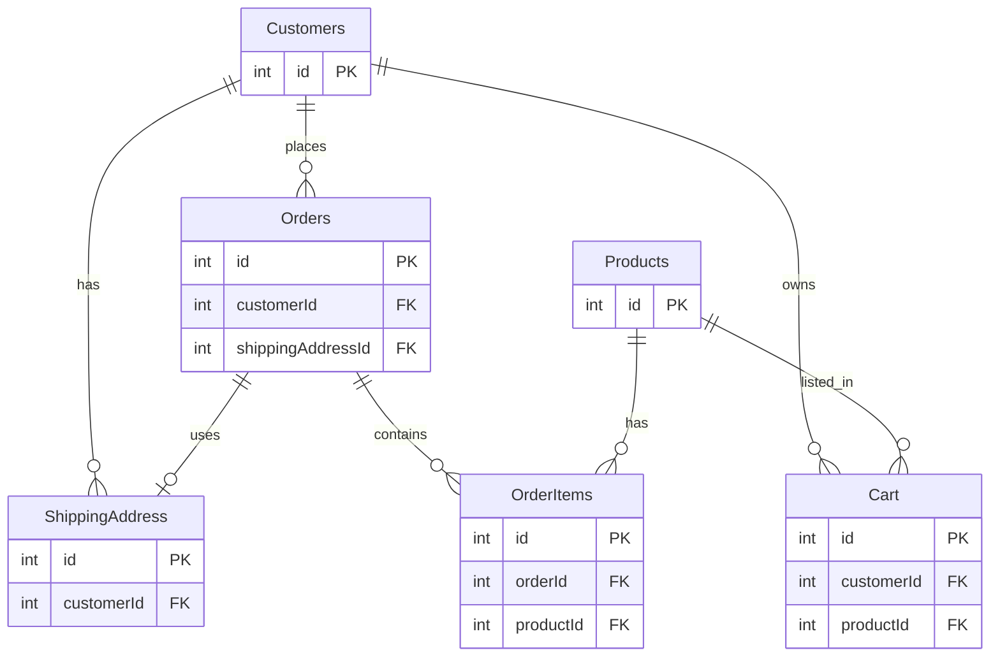

# DB 설계 방법

### 프로세스 (1/6) : 테이블은 어떻게 찾아낼까?
 

### < 테이블(엔티티)을 찾아내는 일반적인 순서 >
- 요구사항 수집 => 명사 도출 => 엔티티 정의
 
 

 
 

 
 

 
 
 

---

### 프로세스 (2/6) : 안전하고 효율적인 구조
- 중복 제거하기 (데이터 중복, 관계 중복)
 

### < 1차 정규화>
- 테이블의 각 컬럼이 원자값(하나의 값)을 가져야 하며, 같은 컬럼 내에서 중복된 값을 허용하지 않음.
- 한 칸에 하나의 데이터

 
 
 

### < 2차 정규화 >
- 1차 정규화를 만족하며, 복합키의 일부에만 종속되는 속성이 없어야 함 (부분 종속 없애기)

 
 
 

### < 3차 정규화 >
- 2차 정규화를 만족하며, 기본키가 아닌 다른 속성에 종속되는 속성이 없어야 함. (이행적 종속 없애기)
- 이행적 종속: A → B, B → C 이면, A → C 라고 할 수 있음. 여기서 C가 사실 A를 직접 의존하지 않고 B를 통해서만 알 수 있는 것.

 
 
 

---

### 프로세스 (3/6) : 쇼핑몰 주문관리 구축하기  #1
 

### < 주요 기능 및 요구사항 >

 
 
 

### < 요구사항에서부터 도출한 엔티티 목록 >

 
 
 

### < 기능 설계 >

 
 
 

### < 기능 - 엔티티 매핑 >

 
 
 

### < ERD >

 
 
 

---

### 프로세스 (4/6) : 설계의 핵심요소 살펴보기
 

### < 설계의 기본 요소 >

 
 
 

### < 구체적인 설계 방법 >

 
 
 

### < 상태 다이어그램을 이용한 네비게이션 설계 >

 
 
 

### < 화면 레이아웃 - 장바구니 >

 
 
 

### < 화면 레이아웃 - 주문화면 >

 
 
 

### 프로세스 (5/6) : 쇼핑몰 주문관리 구축하기 #2
 

### < Primary Key 종류 >
- 1. 자동순번 : 데이터베이스에서 자동으로 증가하는 순번으로, 주로 숫자 형식
  2. 단일키 : 하나의 속성을 기본 키로 사용
  3. 복합키 : 두 개 이상의 속성 또는 열을 결합하여 기본 키로 사용
 

### < Customers >

 

### < Orders >
- 주문 버튼을 클릭하면 Cart에서 선택된 상품만 OrderItems로 옮겨짐. 따라서 Orders와 Cart는 직접적인 연관은 없음.

 

### < Products >

 

### < 결과 >

 
 

---

### 프로세스 (6/6) : 쇼핑몰 주문관리 구축하기 #3
 

### < 엔티티 구성 >
 

### < Customers 테이블 >

 
 
 

### < Order 테이블 >

 
 
 

### < ShippingAddress 테이블 >

 
 
 

### < Cart 테이블 >

 
 
 

### < OrderItems 테이블 >

 
 
 

### < Products 테이블 >

 
 
 

### < orderStatus - 코드로 관리하는 방법 >
- 장점 :
- 1. 데이터 일관성 : 숫자나 상수를 사용하면 데이터의 일관성을 더 잘 유지할 수 있음.
  2. 데이터 크기 절약 : 문자열보다는 숫자나 상수를 사용하는 것이 데이터베이스 공간을 더 효율적으로 사용할 수 있음.
  3. 빠른 검색 속도 : 코드를 사용하면 데이터 조회 속도가 일반적으로 더 빠름.
  4. 국제화 용이 : 상태를 코드로 관리하면 다국어 환경에서의 변환이 쉬움. 예를 들어, '1'을 "배송중", "Shipping", "出荷中" 등으로 쉽게 매핑할 수 있음.
- 단점 :
- 1. 가독성 저하 : 코드 자체로는 의미를 바로 알기 어려워, 주석이나 문서가 필요.
  2. 유지보수 비용: 상태가 추가되거나 변경될 때마다, 해당 코드를 이해하고 있는 개발자가 수정해야 하므로 유지보수 비용이 발생할 수 있음.
